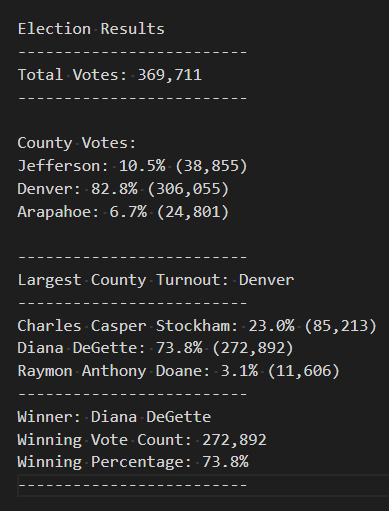

# Election-Analysis
## Project Overview

A Colorado Board of Elections employee assigned the following tasks to complete the election audit of a recent local congressional election.

1. Calculate the total number of votes cast.
2. Get a complete list of candidates who received votes.
3. Calculate the total number of votes for each candidate received. 
4. Calculate the percentage of votes each candidate won.
5. Determine the winner of the election based on popular vote.
6. Calculate the voter turnout for each county.
7. Calculate the percentage of votes from each county out of the total.
8. Determine the county with the highest turnout..

## Resources

**Data Source:** election_results.csv

**Software:** Python 3.9.9, Visual Studio Code 1.62.3

## Summary
    
The analysis of the election shows that:
- There were 369,711 votes cast in the election.

- The candidates were:
    - Charles Casper Stockham
    - Diana DeGette
    - Raymon Anthony Doane

- The candidate results were:
    - Charles Casper Stockham received 23.0% of the vote, for a total of  85,213 votes.
    - Diana DeGette received 73.8% of the vote, for a total of 272,892 votes.
    - Raymon Anthony Doane received 3.1% of the vote, for a total of 11,606 votes.

- The winner of the election was:
    - Diana DeGette, who received 73.8% of the vote for a total of 272,892 votes.

- The voter turnout for each county was:
    - Jefferson produced 10.5% of voters, for a total of 38,855 voters.
    - Denver produced 82.8% of voters, for a total of 306,055 voters.
    - Arapahoe produced 6.7% of voters, for a total of 24,801 voters.

- The county with the largest voter turnout was:
    - Denver, which produced 82.8% of voters, for a total of 306,055 voters.

	

## Election-Audit Summary        
1.In the election analysis, you will be performing mathematical calculations as well as getting non-mathematical data from a file. 
2.Like lists, tuples can be used to store data; however, you can only retrieve data from tuples. 
3.how to retrieve data based on whether a condition is true or false. Retrieving data based on a condition is known as a decision statement. Decision statements are widely used by programmers because they often need to retrieve data from a large dataset that meets certain criteria.
4.The data consists of a number for the ballot ID and a name for the county and candidate, respectively. 
5.Using the election data, you will need to determine the total number of votes cast in the election. Using the code from the previous day, Tom will show you how to programmatically count up all the votes cast in the election by amending the code below the for loop.
Election-Audit Summary: In a summary statement, provide a business proposal to the election commission on how this script can be used—with some modifications—for any election. Give at least two examples of how this script can be modified to be used for other elections.
